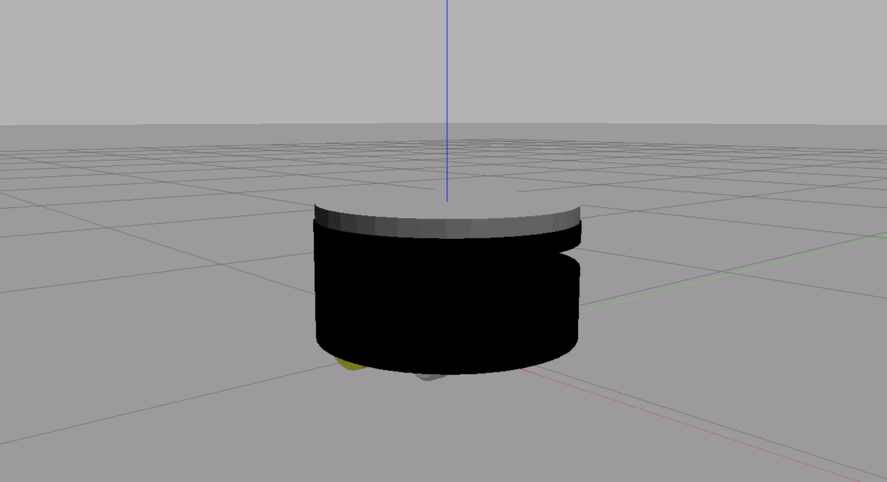
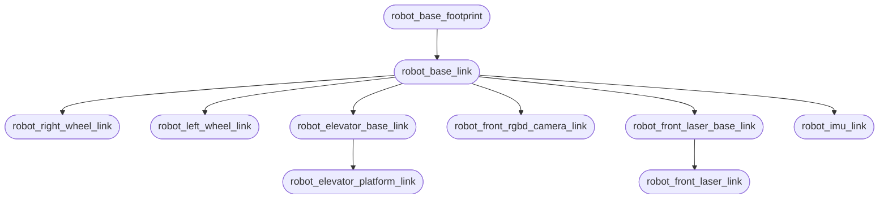
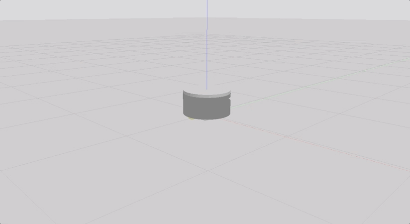

# RB1 Robot

The package adapts from [RB1](https://github.com/RobotnikAutomation/rb1_base_sim) official repository to create a working robot using the URDF, defining all the required links & joints, adding required actuators and sensors, also create launch files to spawn robot in gazebo environment (world) along with implement ROS2 control system.

  

## Structure

```text
.
├── config
│   └── rb1_controller.yaml
├── launch
│   └── rb1_ros2_xacro.launch.py
├── meshes
│   ├── bases
│   ├── elevator
│   ├── others
│   └── wheels
├── urdf
│   ├── bases
│   ├── elevator
│   ├── utils
│   ├── wheels
│   └── common.gazebo.xacro
├── xacro
│   └── rb1_ros2_base.urdf.xacro
├── CMakeLists.txt
└── package.xml
```

## Setup

#### Distribution

Use docker for quick-start (for both ROS1 or ROS2):

```bash
# using docker for ROS1
$ docker run -ti --rm --name local-ros-noetic ros:noetic
```

```bash
# using docker for ROS2
$ docker run -ti --rm --name local-ros-humble ros:humble
```

#### Build (Package)

Now, create a ros2 workspace, clone the package:

```bash
# setup directory
$ mkdir ~/ros2_ws/src/
$ git clone <repo_name> ~/ros2_ws/src/
```

Install the required packages (dependency) mentioned in `package.xml` using `apt`:

```bash
# check if package is available
$ ros2 pkg list
$ ros2 node list
```

```bash
# update path to installed packages
$ source /opt/ros/humble/setup.bash
```

To build locally or inside docker use the following commands:

```bash
# execute build
$ cd ~/ros2_ws && colcon build
$ source ~/ros2_ws/install/setup.bash
```

## Robot (URDF)

The `rb1_robot` is simple four wheel cylinder robot with total weight of `25kg` and accurate physics (i.e. [inertial](https://en.wikipedia.org/wiki/List_of_moments_of_inertia) properties and friction):



#### Links

- `robot_base_footprint` (located at the center bottom of the base cylinder)
- `robot_base_link` (located at the center of the rotation axis that connect the two wheels)
- `robot_right_wheel_link`
- `robot_left_wheel_link`
- `robot_elevator_base_link`
- `robot_imu_link`
- `robot_front_rgbd_camera_link` (located at the front of the base cylinder)
- `robot_front_laser_link`  (located at the front of the base cylinder)

#### TF-Tree

TF tree for some important frames in robot model.



## Launch

The `rb1_ros2_xacro.launch.py` launch file will spawn the robot in empty simulation inside gazebo and contains the following nodes:

- `gazebo` and `spawn_model` (to spawn the model in gazebo environment)
- `robot_state_publisher` (publish the state of a robot to [tf2](http://ros.org/wiki/tf2))

```bash
$ ros2 launch rb1_ros2_description rb1_ros2_xacro.launch.py
```

The launch file will also load `diff_drive_controller`, `effort_controllers` and `joint_state_broadcaster` controllers in controller manager, configuration for all the controllers can be found in `rb1_controller.yaml`.

```bash
# to verify the loaded controllers
$ ros2 control list_controllers
  rb1_elevator_controllers[effort_controllers/JointGroupEffortController] active
  joint_state_broadcaster[joint_state_broadcaster/JointStateBroadcaster] active
  rb1_base_controller [diff_drive_controller/DiffDriveController] active
```

```bash
# to check command and state interfaces
$ ros2 control list_hardware_interfaces
```

**Note:** Gazebo may not always start up properly on the first try. In case you encounter such error, simply kill the process (Ctrl + C) and relaunch.

## Controllers

The loaded controller publishes couple of important topics to interact with the robot, one to move robot in xy plane and second one to control the elevator in RB1 robot.

```bash
$ ros2 topic list | grep "rb1_"
/rb1_base_controller/cmd_vel_unstamped
/rb1_elevator_controllers/commands
```

The robot read velocity message from `/rb1_base_controller/cmd_vel_unstamped` and to move robot use following command:

```bash
$ ros2 topic pub --rate 10 /rb1_base_controller/cmd_vel_unstamped geometry_msgs/msg/Twist "{linear: {x: 0.5, y: 0, z: 0.0}, angular: {x: 0.0, y: 0.0, z: 0.2}}"
```



and, to lift robot elevator use the following commands:

```bash
# lift up
$ ros2 topic pub /rb1_elevator_controllers/commands  std_msgs/msg/Float64MultiArray "{data: [10.0]}" -1
```

```bash
# lift down
$ ros2 topic pub /rb1_elevator_controllers/commands  std_msgs/msg/Float64MultiArray "{data: [0.0]}" -1
```


## Specifications

#### Sensors

The sensors to the robot in order for it to perceive its surroundings (in development, check roadmaps):

- `libgazebo_ros_ray_sensor.so` attached to `robot_front_laser_link` publish on `/scan`.
- `libgazebo_ros_camera.so` attached to `robot_front_rgbd_camera_link` publish on `/image_raw`.
- `libgazebo_ros_imu_sensor.so` attached to `robot_imu_link` publish on `/imu`.

## Roadmap

- [x] Part 1 : URDF description migration to ROS2.
- [x] Part 2 : Set up `ros2_control` and controllers for robot model.
- [ ] Part 3 : Add plugin for camera and IMU sensors to the robot.

See the [open issues](https://github.com/llabhishekll/python-project-template/issues) for a full list of proposed features (and known issues).

## Tools

System tool/modules used for project development.

- `Applications` : [vs-code](https://code.visualstudio.com/), [ros-extensions](https://marketplace.visualstudio.com/items?itemName=ms-iot.vscode-ros) and [docker-desktop](https://docs.docker.com/get-docker/).
- `ROS` : [ros-docker-images](https://hub.docker.com/_/ros/) (`humble`, `noetic`) or [build-source](https://www.ros.org/blog/getting-started/).

## License

Distributed under the MIT License. See `LICENSE.txt` for more information.
